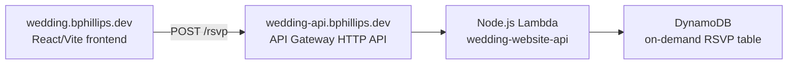

# Production RSVP Architecture

## Status and decision summary

This document defines the production RSVP backend and data contract that later
implementation issues will build. It is an architecture specification, not an
implementation record. The current repository does not yet contain the API,
shared-contract package, DynamoDB table, Lambda, or API Gateway resources.

The production service will use this fixed shape:



The decisions are:

- The public guest API is open and unauthenticated. Its only initial business
  operation is `POST /rsvp`.
- DynamoDB is the RSVP store, using on-demand capacity. The expected traffic
  and access patterns do not justify an instance-based or relational database.
- Every intentional submission creates a new raw record. Guests cannot list,
  retrieve, edit, or delete a prior response.
- Repeating the same technical submit attempt is idempotent. Intentionally
  submitting again later uses a new attempt key and creates a new record.
- Raw submissions contain self-entered guest information only. Canonical
  household data and protected reconciliation are separate future concerns.
- The service sends no confirmation email or SMS. Contact fields are neither
  verified nor used as authentication.
- The existing single Prod `WeddingWebsiteStack` and deployment pipeline will
  eventually own the backend as well as the frontend.
- The production frontend is `https://wedding.bphillips.dev`, and the API is
  `https://wedding-api.bphillips.dev`. `niamhandbrandon.com` is outside this
  architecture and must remain untouched.
- There is no site-wide preview gate. Do not add Basic Auth, a CloudFront auth
  function, Cognito, or another preview mechanism.

The active product sources are
[02_RSVP_GUEST_ACCESS_AND_DATA_DESIGN](https://docs.google.com/document/d/19TJ0zcKDXHnE9Gd_MmDfeobsC9PKiZeOHwtVJ-r_1B4/edit),
[04_FRONTEND_PROTOTYPE_AND_CODEX_HANDOFF](https://docs.google.com/document/d/1BXn-lBbuD5DzEX_Ygy6GLWTzRtTS4bCFKLlHEduqvFo/edit),
and
[05_NEXT_STEPS_AND_CONTINUITY_TRACKER](https://docs.google.com/document/d/1WC4r9dEEFcd0OynZLyRYlo2-up_iP6qeKkuCpLjhGdM/edit).

### Current frontend discrepancy

The approved contract collects contact information once, at the party level.
The #77 implementation currently on `main` still carries and renders
per-adult contact fields as well as party contact. Those per-adult fields are
not part of the production request below. A bounded frontend cleanup must
remove them and invalidate the incompatible local draft format before API
integration. This architecture issue does not change frontend code.

## Repository patterns and package boundaries

The design reuses these repository conventions:

- `docs/REPO_MAP.md` places project-specific schemas and types in a
  `<project>-shared` package and a Lambda-style backend in `<project>-api`.
- Signal Tracker demonstrates the nearest complete web/shared/API/infra family:
  shared Zod route contracts feed the web, API router, and CDK route list.
- `@repo/api-contracts` supplies generic route-contract and API-error helpers.
- `@repo/schema-utils` supplies reusable trimming and optional-string schemas.
- `@repo/api-core` supplies the request/response types, router, errors,
  structured logger seam, and local Node server.
- `@repo/infra-patterns` supplies `HttpLambdaApi`, shared-domain imports, SPA
  hosting, and the existing deployment construct.
- `scripts/publish-spa-assets.mjs` already reads an `ApiBaseUrl` CloudFormation
  output and passes it to Vite as `VITE_API_BASE_URL`.

Later implementation creates these package responsibilities:

### `wedding-website-shared`

- Own the `POST /rsvp` route definition, Zod request and success-response
  schemas, exported inferred types, contract version constant, and the finite
  application error-code union.
- Depend on `@repo/api-contracts`, `@repo/schema-utils`, and Zod.
- Contain no React, Lambda, DynamoDB, CDK, transport client, or persistence
  item types.

### `wedding-website-api`

- Own the Lambda adapter, JSON/body-size checks, request handling,
  idempotency orchestration, DynamoDB repository, server-generated metadata,
  environment parsing, and PII-safe structured logging.
- Reuse the shared route contract and `@repo/api-core` router/error/response
  behavior. Keep DynamoDB item types and request-hash details API-local.
- Provide dependency-injected clocks, ID generation, hashing, and repositories
  so route and idempotency behavior can be tested without AWS.

### `wedding-website-web`

- Later map its validated draft to the shared request type. The local adult
  `id` remains UI state and must not be sent.
- Generate and retain one idempotency key for an intentional submit attempt.
  Reuse it only while retrying the same normalized payload; editing the payload
  or deliberately starting another RSVP creates a new key.
- Resolve the base URL through `@repo/frontend-config`. Production receives
  `VITE_API_BASE_URL` from the deployment pipeline; local development defaults
  to `http://localhost:3001`.

### `wedding-website-infra`

- Extend the existing `WeddingWebsiteStack`; do not create a second stack,
  deployment environment, or pipeline solely for the API.
- Own the table, Lambda, HTTP API, API custom domain and DNS alias, CORS,
  throttling, log groups, alarms, IAM grants, and CloudFormation outputs.

## Public API contract

### Route and headers

```http
POST /rsvp
Content-Type: application/json
Idempotency-Key: 7ad1a5a8-8e35-4d9d-99b0-21181700cb95
```

`Idempotency-Key` is required and must be a canonical UUID v4 string. It is a
technical submission-attempt identifier, not guest identity or authorization.
The API never uses name, email, phone, or side as a deduplication key.

The request body is limited to 32 KiB measured as UTF-8 bytes before JSON
parsing. The body must be one JSON object, and unknown keys are rejected at
every object level.

### Request JSON

```ts
type CreateRsvpSubmissionRequest = {
  guestSide: "niamh" | "brandon";
  adults: Array<{
    name: string;
    attendance: "attending" | "not-sure" | "unable";
  }>;
  childrenAttending: number;
  contact: {
    email?: string;
    phone?: string;
  };
  dietaryOrAllergyNotes?: string;
  accessibilityNotes?: string;
  generalNote?: string;
};
```

Example:

```json
{
  "guestSide": "niamh",
  "adults": [
    { "name": "Example Guest", "attendance": "attending" },
    { "name": "Example Companion", "attendance": "not-sure" }
  ],
  "childrenAttending": 1,
  "contact": { "email": "guest@example.test" },
  "dietaryOrAllergyNotes": "Vegetarian meal, please."
}
```

### Validation and normalization

The shared request schema both validates and produces the normalized object
that is hashed and persisted:

- `guestSide` is required and accepts only `niamh` or `brandon`.
- `adults` contains 1 through 20 entries.
- Each adult name is trimmed, must contain 1 through 100 Unicode characters,
  and otherwise preserves the guest's spelling and internal whitespace.
- Each adult has exactly one of the three attendance values.
- `childrenAttending` is an integer from 0 through 20.
- `contact` is required. Its properties are individually optional, but at
  least one must remain non-empty after normalization.
- Email is trimmed, lowercased, limited to 254 characters, and checked with
  Zod's email validation. Lowercasing is contact normalization, not identity
  matching.
- Phone is trimmed, limited to 32 characters, and must contain 7 through 15
  digits. Formatting characters and an international `+` or `00` prefix are
  preserved; the server does not guess a country or require E.164 conversion.
- Each optional note is trimmed and limited to 2,000 characters. A missing,
  empty, or whitespace-only note normalizes to an omitted property.
- Client adult IDs, client timestamps, canonical household IDs, and a
  client-selected schema version are not accepted.

These bounds support normal wedding parties while bounding item size, log/error
risk, and pathological requests.

### Success response

The first successful write returns `201 Created`:

```json
{
  "submissionId": "3bb32b27-c576-4c70-8078-1285efcc908c",
  "submittedAt": "2026-08-25T18:42:31.412Z",
  "schemaVersion": 1
}
```

An exact technical retry returns `200 OK` with the same values from the
original response. The response never echoes guest PII.

`submissionId` is a server-generated UUID v4, `submittedAt` is a server clock
value serialized as UTC ISO 8601, and `schemaVersion` is the server-owned
stored payload version.

### Errors and HTTP status mapping

All errors produced by the Lambda use the existing repository envelope:

```json
{
  "error": {
    "code": "VALIDATION_ERROR",
    "message": "Request body is invalid."
  }
}
```

| Status | Code                      | Meaning                                                           |
| -----: | ------------------------- | ----------------------------------------------------------------- |
|    400 | `VALIDATION_ERROR`        | Invalid JSON, header, field, requiredness, bound, or unknown key. |
|    409 | `IDEMPOTENCY_CONFLICT`    | The same attempt key was used with a different normalized body.   |
|    413 | `PAYLOAD_TOO_LARGE`       | The Lambda received a request body larger than 32 KiB.            |
|    429 | `THROTTLED`               | Logical client error for an API Gateway rate-limit response.      |
|    500 | `INTERNAL_ERROR`          | Unexpected application failure with a generic safe message.       |
|    503 | `PERSISTENCE_UNAVAILABLE` | DynamoDB remained unavailable after bounded SDK retries.          |

Messages are generic and must not interpolate submitted values. Field-level UI
errors remain a frontend concern; the server is still authoritative.

API Gateway can reject an oversized request, throttle, or fail before invoking
Lambda. HTTP API does not provide response-body templates for all such managed
responses, so their raw bodies are provider-controlled. The frontend transport
must normalize a raw `429` to `THROTTLED` and other nonconforming gateway 5xx
responses to a generic retryable error based on status, without displaying or
depending on the gateway body. Lambda-originated errors always use the envelope
above.

### Contract versioning

The initial stored schema version is numeric `1`. It is a server constant, not
a request field. Additive optional request fields may keep version 1 only when
old readers and deployed clients remain correct. A semantic or incompatible
stored-shape change increments the stored version and adds a version-specific
reader; existing submission items are not rewritten in place.

During a future breaking API rollout, `POST /rsvp` must temporarily accept the
old and new shared request variants until the new web bundle is deployed. A new
URL such as `/v2/rsvp` is warranted only when parallel public behavior must be
maintained longer term. Do not version the initial URL preemptively.

## Idempotency and DynamoDB design

### Table configuration

Use one project-owned table with:

- partition key `pk` of type string and no sort key;
- `PAY_PER_REQUEST` billing;
- Point-in-Time Recovery enabled;
- deletion protection enabled;
- CloudFormation/CDK removal policy `RETAIN`;
- DynamoDB's default AWS-owned encryption at rest;
- no TTL; and
- no GSI.

The public write path requires key operations only. A future protected admin
tool may scan the small table and filter submission items. Tens or hundreds of
items do not justify an initial GSI. Add an index only after a concrete admin
query requires it.

### Item shapes

Each accepted attempt writes two items in one DynamoDB transaction.

Raw immutable submission item:

```ts
type RsvpSubmissionItemV1 = {
  pk: `SUBMISSION#${string}`;
  itemType: "RSVP_SUBMISSION";
  submissionId: string;
  submittedAt: string;
  schemaVersion: 1;
  guestSide: "niamh" | "brandon";
  adults: Array<{
    name: string;
    attendance: "attending" | "not-sure" | "unable";
  }>;
  childrenAttending: number;
  contact: {
    email?: string;
    phone?: string;
  };
  dietaryOrAllergyNotes?: string;
  accessibilityNotes?: string;
  generalNote?: string;
};
```

Technical idempotency item:

```ts
type RsvpIdempotencyItemV1 = {
  pk: `IDEMPOTENCY#${string}`;
  itemType: "RSVP_IDEMPOTENCY";
  requestHash: string;
  submissionId: string;
  submittedAt: string;
  schemaVersion: 1;
};
```

The suffix of the idempotency partition key is SHA-256 of the validated UUID
header. The raw key is not stored. `requestHash` is SHA-256 of a deterministic
JSON serialization of the normalized request using the shared schema's fixed
field order and omitting absent optional properties.

Two item types are preferable to making the client attempt key the submission
primary key: they preserve a server-generated public submission ID, allow a
direct future `GetItem` by `SUBMISSION#<submissionId>`, and prevent duplicates
without a GSI or separate idempotency service.

### Conditional transaction

For a new attempt, the API:

1. Validates and normalizes the request and idempotency header.
2. Computes the key hash and normalized request hash.
3. Generates the submission UUID and timestamp once.
4. Uses `TransactWriteItems` to put both items with
   `attribute_not_exists(pk)` conditions.
5. Returns `201` only after the transaction commits.

If the idempotency condition fails, the API strongly reads the idempotency
item. A matching request hash returns `200` with its original submission ID,
timestamp, and schema version. A different request hash returns `409`. A new
intentional RSVP uses a new UUID header and therefore creates another raw
submission even when names or contact details match.

The submission item remains historically intact. A future admin system must
store processing state, household mappings, or reconciliation notes in
separate items or another protected data model rather than mutating guest-entered
fields. Neither item stores IP address, user agent, geolocation, browser
fingerprint, or other request-device metadata.

## Security, privacy, abuse, and reliability

### Open write path

The endpoint intentionally has no guest authentication. Contact data is for
wedding communication and manual reconciliation only. CORS limits ordinary
browser origins but is neither authentication nor abuse prevention.

The production CORS allowlist is exactly:

- origin: `https://wedding.bphillips.dev`;
- method: `POST` (plus managed preflight);
- headers: `content-type` and `idempotency-key`; and
- credentials: disabled.

Local web development calls a local Node API at `http://localhost:3001`.
Same-Wi-Fi phone testing may use the machine's current LAN host for both web
and API. Local CORS may reflect the local origin or use `*` because it is not a
production service. Production CORS is not broadened for local testing, and
normal unit/integration tests never write to production.

### Low-friction controls

- Configure the HTTP API default stage for a steady rate of 5 requests per
  second and burst capacity of 10.
- Configure Lambda for 256 MB memory, a 5-second timeout, and reserved
  concurrency of 5.
- Use the AWS SDK standard retry strategy with at most three total attempts;
  synchronous API Gateway invocation does not add asynchronous Lambda retries.
- Disable the submit button while a request is in flight. Network retries and
  a repeated double-click reuse the same key and normalized payload.
- Rely on strict schema validation, the 32 KiB body limit, field/array bounds,
  conditional writes, and least-privilege IAM.
- Grant the guest Lambda only `dynamodb:TransactWriteItems` and
  `dynamodb:GetItem` against this table. It receives no `Scan`, `Query`,
  `UpdateItem`, `DeleteItem`, or cross-table access.

Do not add WAF, CAPTCHA, country allowlists or denylists, GeoMatch, IP-region
blocking, browser fingerprinting, or guest identity verification. Legitimate
guests in Ireland, the United Kingdom, Luxembourg, and all other countries must
not be blocked by location. Some low-level spam risk is preferable to guest
friction; stronger controls require observed abuse and a later decision.

### Logging and retention

Create explicit CloudWatch log groups for Lambda and API access logs with
30-day retention. API access logs contain only request ID, route key, status,
integration status, and latency. Do not include source IP, user agent, request
headers, query strings, or body.

Lambda logs are one-line structured JSON. Allowed fields are timestamp, level,
event/category, request ID, route, status, latency, and submission ID after a
successful or idempotently replayed write. Do not log:

- names, email, phone, attendance, child count, or any note;
- request or response bodies;
- raw idempotency keys or hashes;
- IP address, user agent, geolocation, or browser fingerprint; or
- raw validation/DynamoDB exceptions whose messages may contain submitted
  values.

CloudWatch metrics should alarm on sustained API 5xx/Lambda errors rather than
copying payload data into logs. Baseline error metrics, the two log groups, and
their retention belong in the backend-infrastructure issue; a separate
observability service is unnecessary initially.

### Small shared-primitive enhancements

The later implementation should make two backward-compatible shared changes
instead of creating wedding-only infrastructure/runtime frameworks:

1. Export an `HttpLambdaApiProps` interface and allow optional
   `corsPreflight?: CorsPreflightOptions` and
   `defaultStageOptions?: HttpStageOptions`. When stage options are supplied,
   the construct creates the auto-deploying `$default` `HttpStage` explicitly
   so throttling and access logging are configurable. Preserve today's default
   wildcard CORS and implicit stage when these options are absent, keeping
   existing consumers unchanged.
2. Give `createRouter` an optional unexpected-error log sanitizer/callback.
   The wedding API supplies category-only fields so `api-core` does not log the
   raw `Error.message`; existing callers retain their current behavior unless
   they opt in.

## Domain, deployment, and configuration

The API custom domain uses `importDomainFoundation` for the shared
`bphillips.dev` Route 53 hosted zone and ACM certificate, then
`HttpLambdaApi` creates the API mapping and alias for
`wedding-api.bphillips.dev`. Disable the generated `execute-api` endpoint after
the custom-domain path is proven, so the named endpoint is the supported
production origin.

The existing `WeddingWebsiteStack` gains the resources and retains its current
single Prod Source → Validate → Prod pipeline. Future changes to the build and
publish flow are:

- validation builds/tests `wedding-website-shared`, `wedding-website-api`, web,
  and infra through dependency-aware pnpm filters;
- the deploy build compiles API and infra before CDK deploy;
- CloudFormation exports `ApiBaseUrl` and `RsvpTableName` in addition to the
  existing web outputs;
- `publish:web` removes `--skip-api-base-url` so
  `scripts/publish-spa-assets.mjs` injects `VITE_API_BASE_URL` while building;
  and
- frontend components read one central runtime config value rather than
  embedding an environment URL.

Local API route and repository tests use injected fakes or an in-memory
repository. DynamoDB behavior is covered by repository contract tests and CDK
assertions; an explicit, manually approved synthetic production smoke test may
create a clearly labeled record after deployment, but normal automated tests
must not write production RSVPs.

## Deferred admin and retention boundary

The following are intentionally undecided and must not leak into the public
model:

- administrator identity provider and authorization;
- canonical household storage or synchronization with planning sheets;
- submission-to-household matching and processing metadata;
- admin list, inspect, edit, export, archive, and deletion workflows; and
- post-wedding data export, archive, and deletion policy.

Until a later retention decision, RSVP and idempotency items have no TTL. The
public API never receives a canonical household ID and never exposes canonical
guest-list data.

## Follow-on implementation sequence

Do not create these GitHub issues automatically. Create and execute them later
as bounded issues in this order:

1. **Correct the #77 contact-model mismatch.** Remove per-adult contact fields
   and types, retain party-level contact only, bump/invalidate the incompatible
   prototype storage version, and update frontend tests. This must precede API
   integration but does not block shared/API package scaffolding.
2. **Create shared contracts and the API foundation.** Add
   `wedding-website-shared` with schemas/routes/tests and
   `wedding-website-api` with the Lambda/router, dependency seams, in-memory
   repository, idempotency service, and behavior tests. No AWS persistence in
   this issue.
3. **Add production persistence and infrastructure.** Implement the DynamoDB
   repository and transaction behavior; extend shared primitives; add the
   table, Lambda, HTTP API, custom domain, CORS, IAM, logs, throttling, alarms,
   outputs, and single-pipeline changes. Verify with unit, repository-contract,
   CDK assertion, synth, and deliberately invoked synthetic smoke tests.
4. **Connect frontend submission.** Map the cleaned draft to the shared
   contract, add central API configuration, generate/reuse attempt keys,
   handle success/retry/conflict/throttle/failure states accessibly, and reach
   Confirmation only after API acceptance.
5. **Review production operations after real traffic.** Validate metrics,
   costs, throttles, log safety, and spam evidence. Add stronger safeguards
   only when observed behavior justifies a separate issue; baseline safeguards
   already belong to step 3.
6. **Later: design protected admin authentication.** Choose admin identity and
   authorization separately from guest contact data.
7. **Later: build admin review and reconciliation.** Add protected raw
   submission review and mapping to separately managed canonical households
   using the admin architecture chosen at that time.
